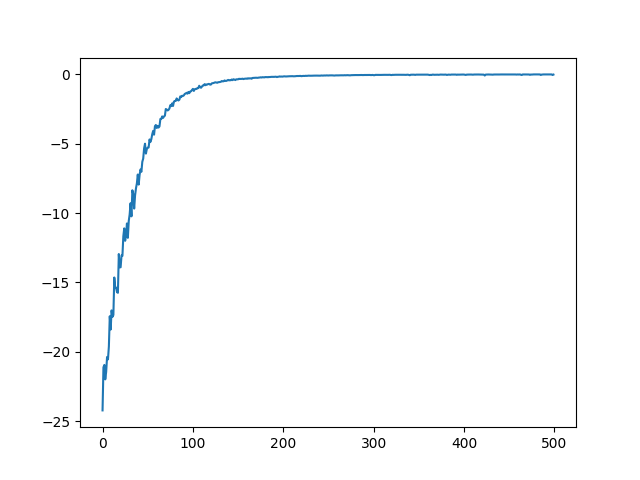
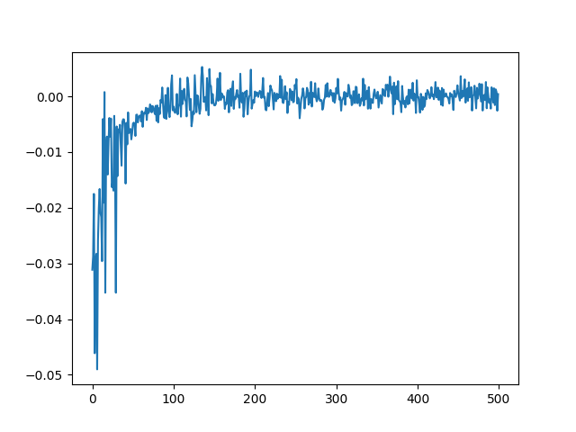
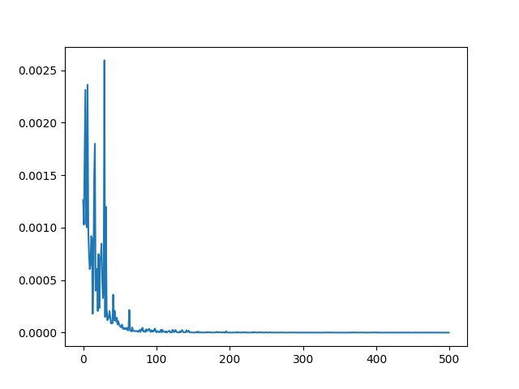
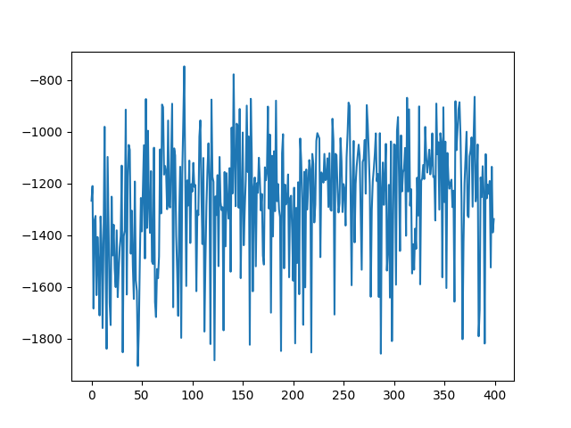

# A2C

현재까지는 state는 1차원 벡터, action은 continous한 환경에서만 작동합니다.

## 파일 설명 

agent.py : A2C 알고리즘이 구현된 파일입니다.

Argument.py : A2C 알고리즘에서 사용된 하이퍼 파라미터를 관리하는 파일입니다.

main.py : A2C 알고라즘을 실행하는 파일입니다.

Model/MLPMODEL : actor와 critic network가 정의된 파일입니다.

## 학습 실행 방법

```
python3 main.py
```

## 결과 보기

```
python Result_visualize.py --type 원하는 결과
```
원하는 결과

1. actor_loss
2. critic_loss
3. episode_reward


## 실험 결과

1. MountainCarContinuous-v0
- Episode Reward


- Actor Loss | Critic Loss

 


2. Pendulum-v0

학습이 되지 않았다. 

- Episode Reward

